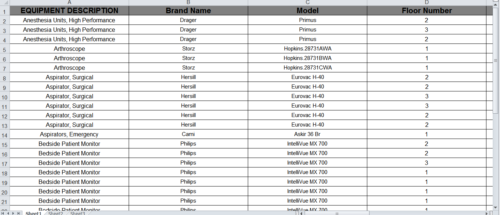
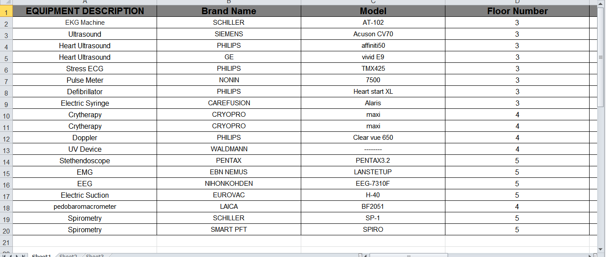
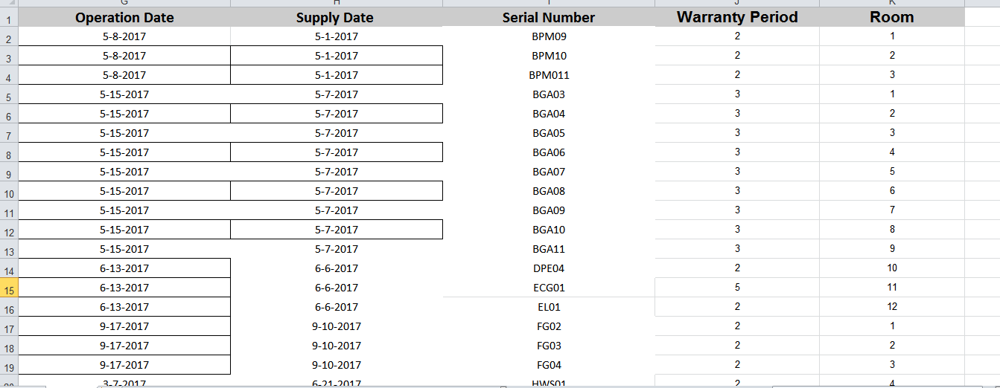
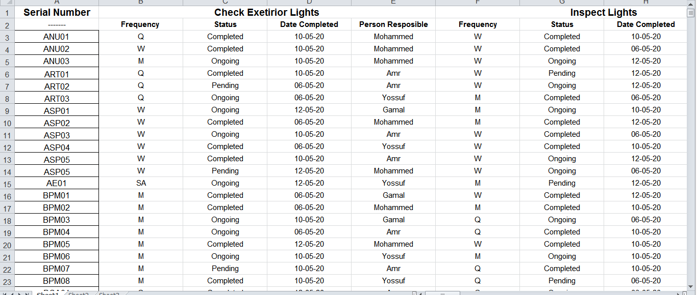
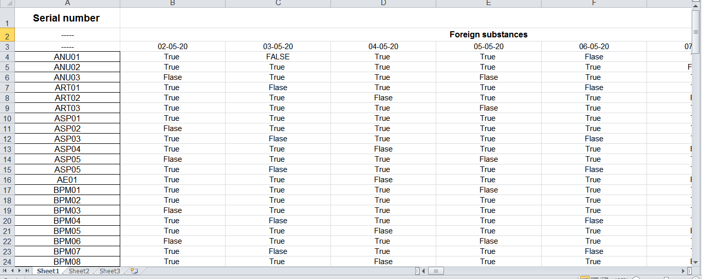
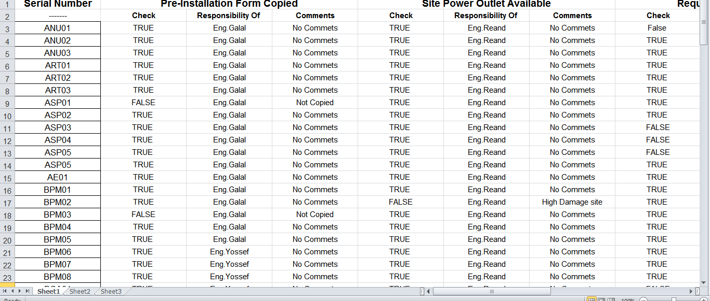
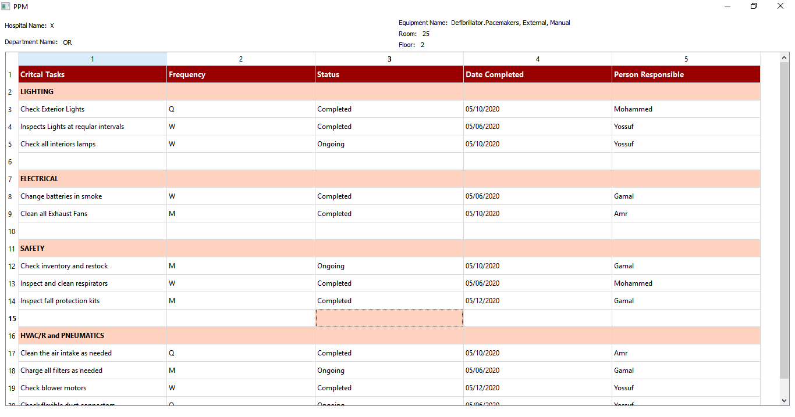
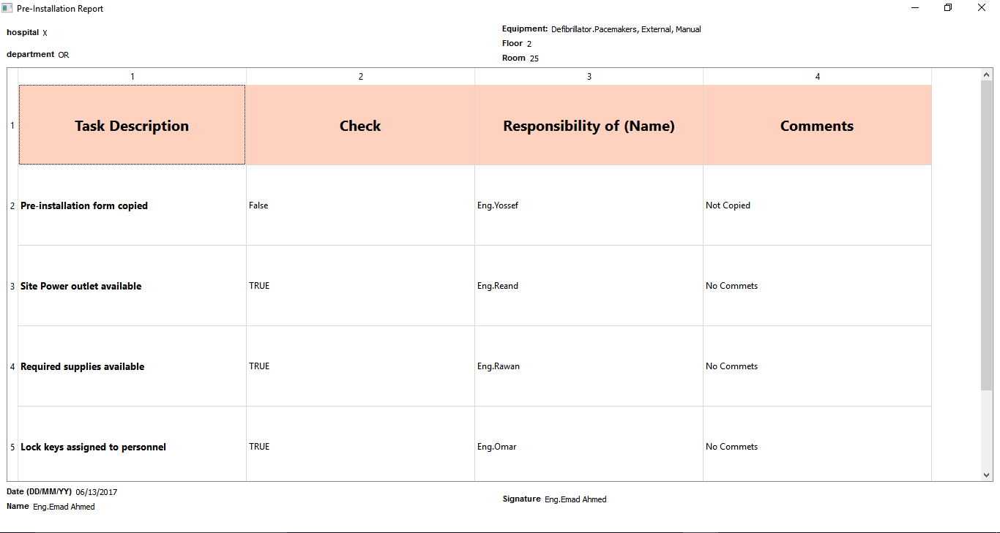
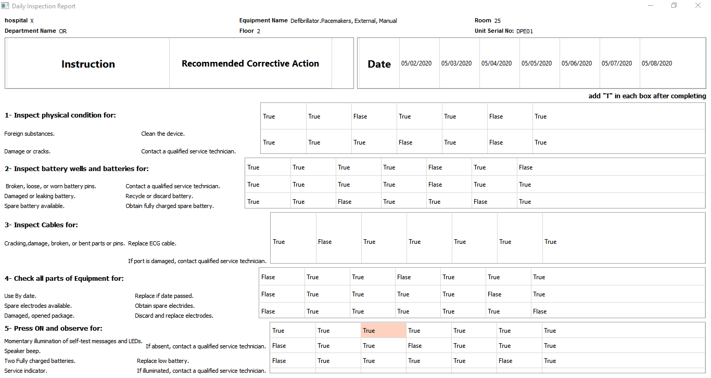

# &emsp;&emsp;&emsp;&emsp;&emsp;&emsp;**`Hospital Data base`**
# **`Team 14`** :
### 1- Mohammed El-Sayed &emsp;&emsp;&emsp;&emsp;2- Zeinab Walid
### 3- Galal Hossam  &emsp;&emsp;&emsp;&emsp;4- Abdullah Reda
### 5- Mohammed Omar 

# **`ABOUT`**

### Our data is collected from "Dar el fouad" & "elshourta" hospitals.
### We implement a software that use that data base and make a gui for 3-reports for 3-departments. 
### We make our data base in Excel format as we find in many hospital and make a desktop application to make easy software to use.

# **`Output`**
### The final outputs & data collected from "Dar el fouad" & "elshourta" hospitals. 
### This data base include each medical equipment in this departments, serial number, model, room number, floor, brand name, model .... etc.
### 1. OR Data 
###

### 2. OUTPAIENT Data 
###

### 3. CCU Data 
###

### 4. PPM Data 
###

### 5. DAILY ISPECTION Data 
###

### 6. PRE INSTALLATION Data 
###

### 7. PPM REPORT
###

### 8. PRE INSTALLATION PRPORT
###

### 9. DAILY INSPECTION DATA  
###

# **`DEPENDENCES`**
### Use " pip install library_name " in the cmd widow to install any newlibrary like `xlrd , PyQt5 ... etc `
### ex : `pip install xlrd ` 
 
# **`HOW TO USE`**
### you must install all dependences that is not included in your device and just run any file by typing in terminal `python file_name.py.`
### Choose department you want and device and select the serial number to differ betweeen each device and then select a report.

